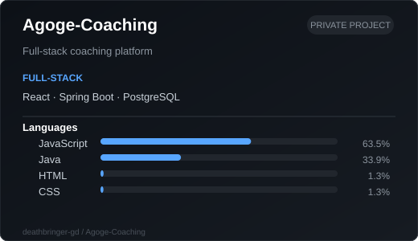

# deathbringer-gd

### Full-Stack · Systems · Security

---

## `> whoami`

**Full-Stack** — React, Java, Spring Boot, PostgreSQL

**Systems** — C, Assembly, Linux

**Security** — Bug-bounty, Web hacking, 3 valid bugs found

**Automation** — Python, Security tooling

---

## `> projects`

  

---

## `> stack`

 

 

---

## `> github`

  
  

---

`C` · `Java` · `Python` · `JavaScript` · `React` · `Spring Boot` · `Linux`

